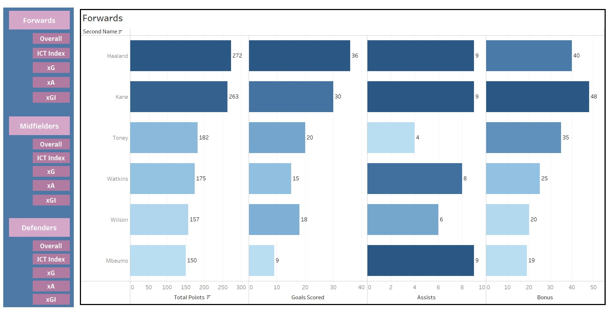
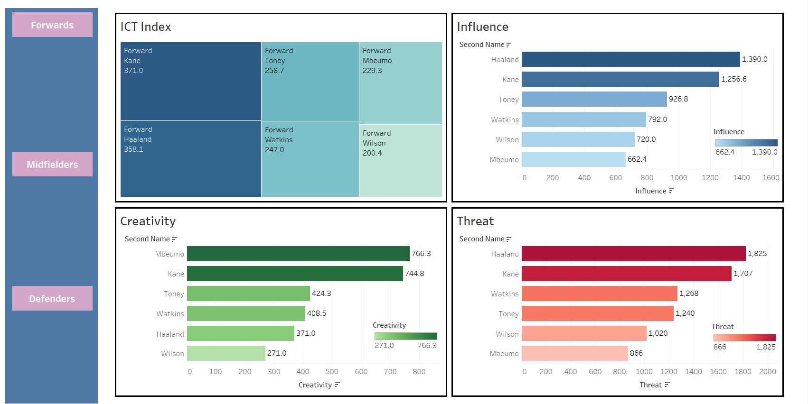
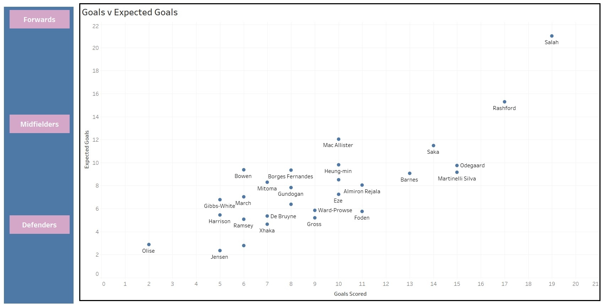
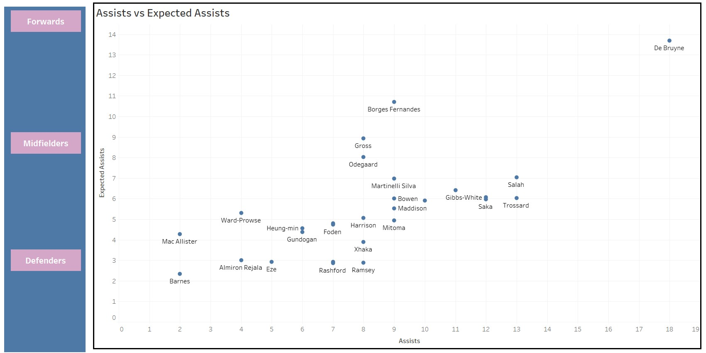
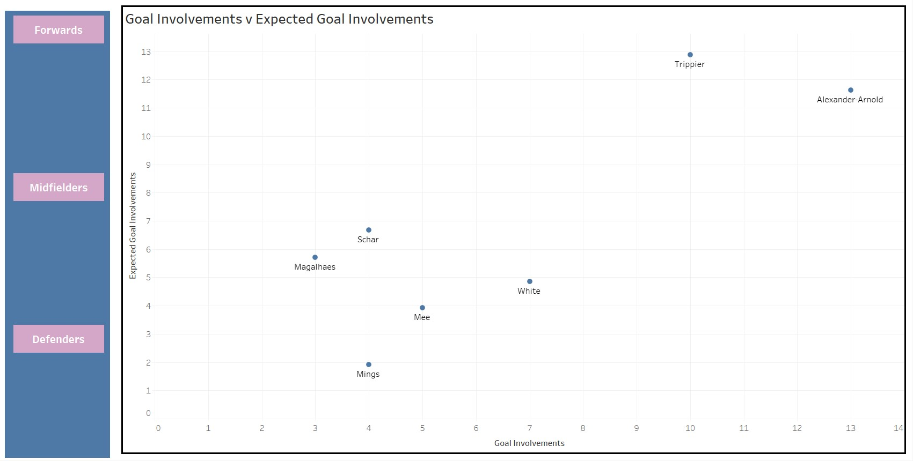

# FPL Top Performers

Dashboard of the top performing outfield players in Fantasy Premier League 2022-23

**Viz link:** https://public.tableau.com/app/profile/rishikeshav.ravichandran/viz/FPLTopPerfomers/DxGI_1?publish=yes

5 Metrics were measured based on the 50 top performing outfield players and categorized by position:

- **Overall Stats** (Total Points, Goals, Asists, Bonus Points)

- **ICT Index** (Influence, Creativity, Threat)

- **G v xG** (Goals vs Expected Goals)

- **A vs xA** (Assists vs Expected Assists)

- **GI vs xGI** (Goal Involvements (Goals+Assists vs Expected Goal Involvements)

